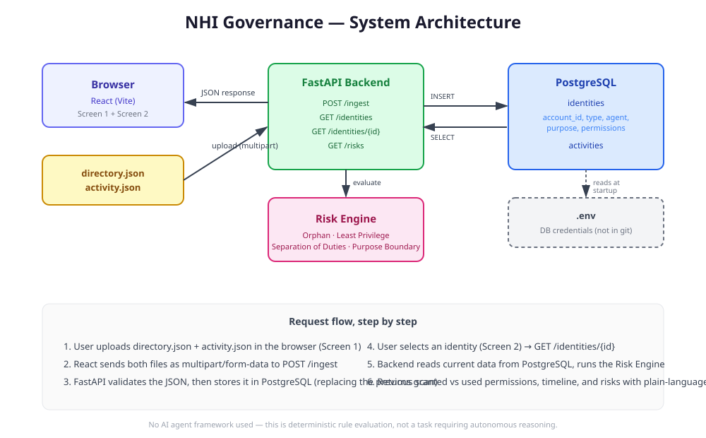

# NHI Governance Dashboard

A web application for discovering, mapping, and auditing **Non-Human Identities (NHIs)** — API keys, service accounts, and AI agent credentials — against three core security principles: **Orphan Identity detection**, **Least Privilege**, and **Segregation of Duties**. It also includes a bonus **Purpose Boundary** check.

## The problem this solves

Organizations monitor human employee logins carefully, but non-human identities (API keys, service accounts used by AI agents and automation) are usually left unmonitored. This creates real risks:
- Credentials left behind with no owner ("orphan identities")
- Agents holding permissions they never actually use ("over-provisioning")
- A single identity able to both create and approve a sensitive action, like a payment ("segregation of duties violations")

This app simulates a discovery scan: it ingests a directory of known identities and a log of their recent activity, evaluates them against these principles, and presents the findings on a dashboard with plain-language explanations.

## How it works — architecture



```
┌─────────────┐         ┌──────────────┐         ┌─────────────┐
│   Browser   │  upload  │              │  reads   │             │
│   (React)   │ ───────> │   FastAPI    │ <──────> │ PostgreSQL  │
│             │ <─────── │   Backend    │          │  Database   │
└─────────────┘  JSON    └──────────────┘          └─────────────┘
                              │
                              ▼
                       ┌──────────────┐
                       │  Risk Engine │
                       │ (pure Python)│
                       └──────────────┘
```

**Flow:**
1. User uploads two JSON files (a directory/discovery file and an activity log file) through the React UI.
2. The FastAPI backend parses and validates the files, then stores the data in PostgreSQL.
3. When the dashboard requests risk data, the backend reads the current identities and activity from PostgreSQL and runs them through the risk engine.
4. The risk engine evaluates each identity against the four checks and returns structured results, each with a plain-language explanation.
5. The React frontend displays the Identity Register (Screen 1) and, per selected identity, the risk analysis with alerts, a granted-vs-used permissions comparison, and an activity timeline (Screen 2).

## Tech stack

| Layer | Choice | Why |
|---|---|---|
| Language | Python | Required by the assignment; also well suited to data processing and rule evaluation. |
| Backend | FastAPI | Lightweight, fast to build with, automatic interactive docs (`/docs`) which made manual testing easy during development. |
| Database | PostgreSQL | Required RDBMS; used to persist the "current state" of a discovery scan rather than reprocessing files each time. |
| Frontend | React (Vite) | Required frontend framework; Vite was chosen over Create React App for faster local dev/build times. |
| Agent framework | None | Deliberately not used. This is a deterministic rule-evaluation problem (compare permissions, detect conflicts) — an LLM/agent framework like LangGraph would add complexity and non-determinism without adding value. The assignment explicitly allows building without an agent. |

## Project structure

```
nhi-governance/
├── app/
│   ├── api.py            # FastAPI routes
│   ├── data_loader.py     # (legacy) JSON file reader, used in early dev
│   ├── db.py              # PostgreSQL connection + read/write functions
│   └── risk_engine.py     # Core risk evaluation logic
├── data/
│   ├── directory.json     # Sample mock directory data
│   └── activity.json      # Sample mock activity data
├── docs/
│   └── architecture.svg    # System architecture diagram
├── frontend/
│   └── src/
│       ├── App.jsx         # Screen 1 + Screen 2 UI
│       └── App.css         # Styling
├── migrate_data.py         # One-off script used during early development to seed the DB
├── requirements.txt
└── README.md
```

## API Endpoints

| Method | Path | Purpose |
|---|---|---|
| GET | `/` | Health check |
| POST | `/ingest` | Upload `directory_file` and `activity_file` (multipart form data); parses and stores them in PostgreSQL, replacing the previous scan's data |
| GET | `/identities` | List all discovered identities |
| GET | `/identities/{account_id}` | Full detail for one identity: granted vs used permissions, activity timeline, and its specific risks |
| GET | `/risks` | All risks across all identities |

## Risk checks implemented

- **Orphan Identity** — flags identities with no assigned agent (`agent` is `null` or missing).
- **Least Privilege** — compares granted permissions against permissions actually used in the activity log; flags any granted-but-unused permission.
- **Segregation of Duties** — flags any identity holding both `write:payments` and `approve:payments`, since this lets a single identity complete a financial transaction alone.
- **Purpose Boundary** *(bonus, not required by the assignment)* — flags when an identity accesses a resource outside the resources associated with its registered purpose.

Each risk includes a `reason` field with a plain-language explanation, generated dynamically from the actual data (not a static template), so the dashboard can explain *why* something was flagged without a human needing to interpret raw permission strings.

## Data model — assumptions made

The assignment provided an example JSON shape but explicitly invited building a custom data model ("choose your own data modeling approach"). This project's simplified structure:

**directory.json** — a flat list of identity objects:
```json
{
  "account_id": "svc-invoice-bot-prod",
  "type": "service_account",
  "agent": "Invoice Processing Agent",
  "purpose": "Invoice Processing",
  "permissions": ["read:invoices", "write:payments", "approve:payments"]
}
```

**activity.json** — a flat list of activity events:
```json
{
  "account_id": "svc-invoice-bot-prod",
  "timestamp": "2026-08-10T09:01:00Z",
  "action": "read",
  "resource": "invoices"
}
```

This was chosen for simplicity over the assignment's nested example structure (`discovered_accounts` wrapper, `owner_agent`/`registered_purpose` naming) — flatter data was easier to reason about and sufficient to demonstrate the same governance logic.

The `purpose_resources` mapping (which resources are "in bounds" for a given purpose) is currently hardcoded in `risk_engine.py`. In a production system this would live in a database table so purposes/resources could be managed without a code change — see Limitations below.

## Known limitations

- **Hardcoded purpose-to-resource mapping.** Adding a new "purpose" currently requires a code change, not just new data. This was a deliberate simplification for a scoped assignment; a real system would store this as configurable policy data.
- **Each scan replaces prior data.** `/ingest` truncates and reloads both tables rather than versioning scans over time. This keeps the data model simple but means historical scan-over-scan comparison isn't possible yet.
- **No authentication.** Anyone with network access to the app can upload data or view the dashboard. Out of scope for this assignment, but would be required before any real deployment.
- **No live cloud integration.** As permitted by the assignment, this uses mock JSON uploads instead of real AWS/Azure/GCP API calls. The evaluation pipeline (ingest → map → evaluate → alert) is the same either way; swapping in real cloud discovery would mean replacing the `/ingest` file-upload step with a scheduled API poller.
- **Single-tenant.** No concept of multiple organizations/environments; the whole database represents one scan at a time.

## Possible future improvements

- Store scan history (add a `scan_id` and `scanned_at` timestamp) so trends over time can be shown, not just the latest state.
- Move `purpose_resources` into a database table with a small admin UI.
- Add authentication and per-user audit logging of who ran a scan.
- Add automated tests for the risk engine's four checks (currently manually verified against the assignment's example scenarios).

## Running the project locally

### Prerequisites
- Python 3.10+
- Node.js 18+
- PostgreSQL running locally, with a database created (e.g. `nhi_governance`)

### 1. Set up the database
Create these two tables in your PostgreSQL database:
```sql
CREATE TABLE identities (
    account_id VARCHAR PRIMARY KEY,
    type VARCHAR,
    agent VARCHAR,
    purpose VARCHAR,
    permissions JSONB
);

CREATE TABLE activities (
    activity_id SERIAL PRIMARY KEY,
    account_id VARCHAR,
    timestamp TIMESTAMPTZ,
    action VARCHAR,
    resource VARCHAR
);
```

### 2. Backend
```bash
pip install -r requirements.txt
```

Create a `.env` file in the project root:
```
DB_NAME=nhi_governance
DB_USER=postgres
DB_PASSWORD=your_password_here
DB_HOST=localhost
DB_PORT=5432
```

Run the server:
```bash
uvicorn app.api:app --reload
```
Backend runs at `http://127.0.0.1:8000`. Interactive API docs at `http://127.0.0.1:8000/docs`.

### 3. Frontend
```bash
cd frontend
npm install
npm run dev
```
Frontend runs at `http://localhost:5173`.

### 4. Try it
Open `http://localhost:5173`, upload the sample `data/directory.json` and `data/activity.json` files, click "Run Discovery Scan," then click any identity in the table to view its risk analysis.